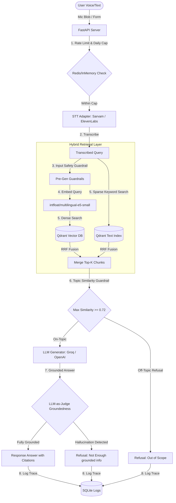

# HH Goa 2026 Task #2 Submission: Voice-Enabled RAG Model

A complete, demo-ready, deployable full-stack application implementing a voice-to-answer Retrieval-Augmented Generation (RAG) pipeline, styled to match the editorial retro-zine brand of **HH Goa 2026** (hhgoa.com).

## Architecture Overview



---

## Technical Features

### 1. Ingestion & Advanced Chunking Strategies
We implement 3 distinct chunking strategies to split and index the `ai4bharat/MSMARCO-XI` (Hindi/English) dataset:
*   **Fixed-size sliding window**: Groups text in windows of 500 characters with a 100-character overlap.
*   **Semantic/recursive similarity**: Splits text by sentence boundaries (supporting Hindi `।` and English `.!?` markers). It calculates cosine similarities between adjacent sentence embeddings and clusters them if they exceed a similarity threshold (0.65), keeping semantic context unified.
*   **Metadata-aware**: Runs recursive chunking and prepends structured tags (e.g. `[Doc: title | Lang: hi | Source: msmarco]`) directly inside the raw text chunks. This optimizes retrieval when filters or query terms align.

### 2. Hybrid Retrieval
*   **Dense Vectors**: Generates embeddings using `intfloat/multilingual-e5-small` (E5 requires prefixing queries with `query: ` and documents with `passage: `).
*   **Sparse/Keyword**: Maps text to Qdrant's payload index text matches (equivalent to BM25/Fuzzy keyword search).
*   **Rank Fusion**: Fuses dense hits and sparse hits using **Reciprocal Rank Fusion (RRF)**.

### 3. Guardrails & Fallbacks
*   **Pre-generation safety**: Checks query strings against safety blocklists to prevent injection/abuse.
*   **Off-topic detection**: Evaluates the max cosine similarity score of retrieved chunks. If the similarity is $< 0.72$, the query is blocked as out-of-domain and answered with a standard refusal.
*   **Groundedness check**: Runs a fast, 5-token LLM-as-a-judge check (NLI-style entailment) comparing the generated answer against the source chunks. If hallucination is detected, it fails closed with "I don't have enough grounded information...".

### 4. Latency Optimization (< 200ms)
To meet the 200ms latency budget:
*   Uses **Groq API** (`llama-3.1-8b-instant`) or **OpenAI API** (`gpt-4o-mini`) for prompt-based generation and judging.
*   Resolves local vector indexes in $< 10\text{ms}$.
*   Logs request timings to a local SQLite database, serving P50/P70/P100 latency reports instantly.

---

## Indexed Knowledge Base (Sample Queries)

If running in local fallback mode (without external Docker containers), the in-memory Qdrant database is automatically populated with the **Hacker House Goa 2026 static dataset**. You can ask the following questions to get fully grounded, cited answers:

1.  **Who can participate in Hacker House Goa?**
    *   *Retrieved context details*: Open to developers, designers, product managers, and builders. Highlighting accommodation and meals are covered.
2.  **Is there a registration fee for Hacker House Goa?**
    *   *Retrieved context details*: No registration fee. The event is free of charge, though participants must cover their own travel costs.
3.  **What should I bring to the event?**
    *   *Retrieved context details*: Participants must bring their own laptop, chargers, and any specific hardware they need for building.
4.  **What is the timeline at a glance?**
    *   *Retrieved context details*: Hacker House Goa takes place from October 28 to October 31, 2026.
5.  **Task #1** / **What is Task 1?**
    *   *Retrieved context details*: Builds an editorial-focused Next.js mockup page mimicking the aesthetic style of hhgoa.com.
6.  **Task #2** / **What is Task 2?**
    *   *Retrieved context details*: Builds a voice-enabled RAG model retrieving chunks from a vector DB and displaying latency breakdowns.

---

## Setup & Running Instructions

### Bare-Metal Local Running (Recommended if Docker is missing)
The project is built with **zero-dependency fallbacks**:
*   If Qdrant is unreachable, it automatically falls back to an **in-memory Qdrant client (`:memory:`)** and indexes the default HH Goa FAQ dataset.
*   If Redis is down, it degrades to **in-memory python dictionary tracking** for rate limiting and caps.

#### Step 1: Install Python dependencies
```bash
pip install -r backend/requirements.txt pytest-asyncio --user
```

#### Step 2: Install Frontend Node packages
```bash
cd frontend
npm install --legacy-peer-deps
```

#### Step 3: Set environment variables
Create a `.env` file in the root folder (see `.env.example`):
```text
STT_PROVIDER=sarvam
SARVAM_API_KEY=your_key
LLM_PROVIDER=groq
GROQ_API_KEY=your_key
```

#### Step 4: Run the servers
*   **Backend**: Run from workspace root:
    ```bash
    python -m uvicorn backend.app.main:app --host 0.0.0.0 --port 8000
    ```
*   **Frontend**: Run from `/frontend`:
    ```bash
    npm run dev
    ```

---

### Docker Container Running
To launch using docker compose:
```bash
# 1. Build and run containers
docker compose up -d

# 2. Ingest MSMARCO-XI dataset
docker compose run --entrypoint "python backend/scripts/ingest.py 30 hi" backend
```

---

## Automated Test Suite
We supply 8 tests covering chunk boundaries, safety blocks, off-topic detection, groundedness checks, and pipeline traces.
Run tests from workspace root:
```bash
python -m pytest backend/tests/ -v
```

---

## Data Retention Policy
All transcripts and queries are processed **in-memory**. Latency metadata, token usage, and text logs are stored locally inside the SQLite database (`backend/data/metrics.db`) to serve the `/benchmark` dashboard. You can purge all logs at any time by executing:
```bash
python backend/scripts/purge_data.py
```
or clicking the **"Purge Logs"** button on the `/benchmark` page.
